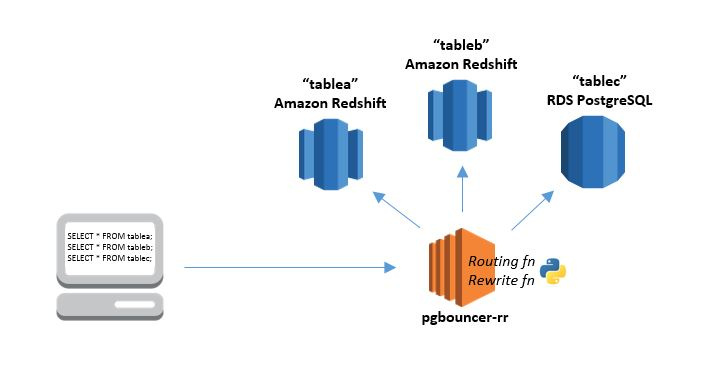

Go pgbouncer-rr example
=======================

This repository contains an example of routing postgres queries from a Go application containing a rest api to different postgres instances (e.g. master,slave) using a modified version of [pgbouncer](https://github.com/pgbouncer/pgbouncer) by amazon: [pgbouncer-rr-patch](https://github.com/awslabs/pgbouncer-rr-patch).

### pgbouncer-rr-patch (extracted from [pgbouncer-rr-patch](https://github.com/awslabs/pgbouncer-rr-patch))

The pgbouncer-rr project is based on pgbouncer, an open source PostgreSQL connection pooler. It adds two new significant features:

1. Routing: intelligently send queries to different database servers from one client connection; use it to partition or load balance across multiple servers/clusters.
2. Rewrite: intercept and programmatically change client queries before they are sent to the server: use it to optimize or otherwise alter queries without modifying your application.



### Dependencies

* docker and docker-compose - for running dev dependencies
* go >= 1.11 - for running the example app
* (optional) curl - for sending test requests

### Running

* start deps, the command below will start 2 postgres instances (master and slave) and a pgbouncer-rr using docker-compose
```
make deps
```

* check that the dependencies are running:
```
docker ps
```
You should see an output like that:
```
$ docker ps
CONTAINER ID        IMAGE                        COMMAND                  CREATED             STATUS              PORTS                    NAMES
f5e4cd538fc4        felipejfc/pgbouncer-rr:0.1   "/entrypoint.sh /usr..."   28 minutes ago      Up 28 minutes       0.0.0.0:5434->5432/tcp   go-pgbouncer-example_pgbouncer-rr_1
9d8a6c5da28e        bitnami/postgresql:11        "/entrypoint.sh /run..."   32 minutes ago      Up 32 minutes       0.0.0.0:5433->5432/tcp   go-pgbouncer-example_postgresql-slave_1
6015f5ff50b1        bitnami/postgresql:11        "/entrypoint.sh /run..."   32 minutes ago      Up 32 minutes       0.0.0.0:5432->5432/tcp   go-pgbouncer-example_postgresql-master_1
```

* run go example app
```
make run
```

You can then follow the pgbouncer-rr container logs to see how it works, you'll see that as per the config in ```pgbouncer-rr/etc/routing_rules.py``` every query starting with ```(INSERT|UPDATE|DELETE|START|COMMIT|ROLLBACK)``` will be routed to example.1 instance (master) and every query starting with ```SELECT``` will be routed to example.2 instance (slave). Every other query that does not fit in any of the regex queries will be routed to the default example instance (master).
```
docker logs -f go-pgbouncer-example_pgbouncer-rr_1
```

* send queries or use a postgres client to enter the db and run some commands:

Create a new TODO
```
curl -H "Content-Type: application/json" -d '{"id":1,"name":"New Todo"}' http://localhost:8080/todo
```
Get a TODO
```
curl localhost:8080/todo/1
```

### Other use-cases

This is just an example of what you can do using pgbouncer-rr, sending write ops to a master and reads to a slave. You could also route based on the table being accessed, the user making it or even a specific query to different dbs.
Because pgbouncer-rr uses python scripts this could be extended to a lot other use cases, like sending a stream of queries to a kafka instance for example.
